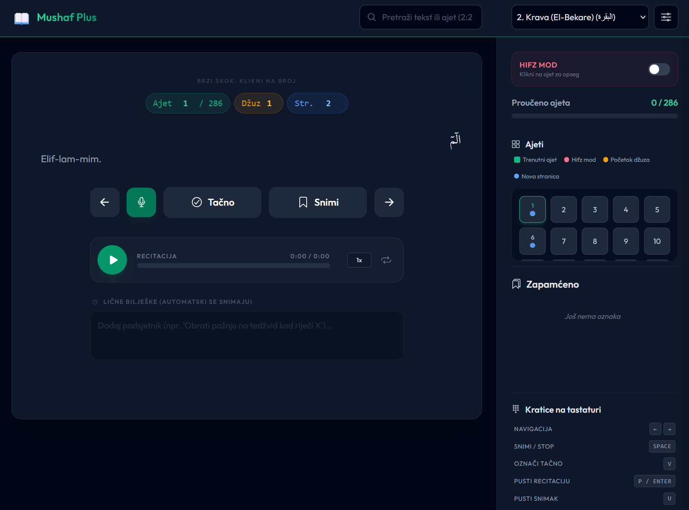

# Mushaf Plus 📖

A premium, fully responsive browser-based application designed to help users memorize and perfect their Quranic recitation (Tajweed) with Bosnian localized interface.

Built entirely with modern Web Technologies, this app operates entirely locally in the browser, offering a highly responsive, offline-capable, and private environment to study.



## ✨ Key Features

- **Zero-Latency Audio**: Enjoy completely gapless continuous playback between Ayahs thanks to intelligent background audio preloading.
- **Lightning-Fast Search**: Search queries now process instantly in the background without freezing the app, even on older devices.
- **Integrated Ayah Navigation**: Jump to any Ayah instantly by simply typing the number directly into the Ayah counter in the main view.
- **Minimalist Juz & Page Navigation**: Jump to any Juz (1-30) or Page (1-604) directly from the header via input boxes.
- **Hifz Mode (Memorization)**: A dedicated mode for looping specific Ayah ranges. Select a start and end Ayah, enable Auto-play, and the app will continuously loop within your selection.
- **Remote Reciters (EveryAyah)**: Choose from multiple world-class reciters (Mishary Alafasy, Al-Sudais, etc.) in the Settings to stream high-quality audio directly from EveryAyah.com.
- **Centralized Bosnian Translation**: Fully localized interface using a custom `i18n.js` translation engine.
- **Tajweed Color-Coding & Tooltips**: Advanced text engine that highlights Tajweed rules (Ikhfa, Izhar, Qalqala, etc.) with real-time tooltips explaining each rule upon click.
- **Global Search Engine**: Instantly search across the entire Quran by text content or reference (e.g., "2:255"). Operates with a debounced results dropdown.
- **Self-Recording Engine**: Uses your device's microphone to let you record your own recitation. Play it back immediately to compare your Tajweed against the Sheikh's recitation.
- **Interactive Typography Settings**: Customize your study experience with live-updating sliders for Arabic font size, translation size, and line height. Features a live preview of Surah Ikhlas.
- **Dual Mode UI**: Seamless toggle between Dark Mode and Light Mode, with multiple accent themes (Emerald, Blue, Amber, Rose, Purple, Teal).
- **Progress Tracking & Grid**: Mark Ayahs as "Valid" (memorized) to visually track progress. Features a compact, responsive Ayah grid for quick navigation.
- **Bookmarks & Notes**: Save your favorite spots and attach private notes to any Ayah. Your session is automatically restored (last surah viewed) upon reopening the app.
- **Keyboard Shortcuts**: Advanced shortcuts for hands-free study (`Space` to record, `P` for Sheikh, `U` for user recording).
- **Data Portability**: Import/Export your progress, bookmarks, and notes as a JSON file.

## 🛠 Tech Stack

- **Frontend**: HTML5, Vanilla JavaScript (ES6+)
- **Styling**: Tailwind CSS + Custom CSS (`css/styles.css`) for fine-tuned responsiveness and theme variables.
- **Icons**: [Ionicons](https://ionic.io/ionicons)
- **Data**: Static JavaScript arrays containing the Quranic text and references (`quran_data.js`).
- **Localization**: Specialized `i18n.js` for dynamic string management.
- **SVG Processing**: `svg-layer-detector.js` for universal detection and coloring of Quran SVG page elements.
- **Search**: Web Workers (`searchWorker.js`) for background processing of full-text search.
- **Audio**: MediaRecorder API for user recording and playback controls.
- **Tajweed**: CSS Custom Highlight API for text highlighting without breaking Arabic ligatures.

## 🚀 Getting Started

Running the app is simple as it requires no backend. To run:

1. Clone or download this repository.
2. Ensure you have the audio MP3 files in an `mp3/` folder (format: `[SurahNumber][AyahNumber].mp3`).
3. Open `index.html` in any modern web browser.

### 🎨 Development & Styling

The app uses a static production build of **Tailwind CSS**. If you modify the `index.html` structure or add new classes, you need to rebuild the CSS:

```bash
npx tailwindcss -i ./css/input.css -o ./css/tailwind-output.css --minify
```

### Note on Microphone Permissions

Microphone access requires a secure context (HTTPS or localhost). If running locally, please use a server like **VS Code Live Server** or similar to enable the recording feature.

## 🗂 Project Structure

```text
├── index.html              # Main UI - Header, Ayah Card, Sidebar, Modals
├── manifest.json           # PWA configuration
├── service-worker.js       # Offline caching & auto-update logic
├── package.json            # NPM dependencies (Tailwind CSS)
├── tailwind.config.js      # Tailwind CSS configuration
├── build-css.bat           # Script to rebuild Tailwind CSS
├── run_server.bat          # Local development server
│
├── css/
│   ├── input.css           # Tailwind source directives
│   ├── styles.css          # Custom CSS (typography, themes, animations)
│   └── tailwind-output.css # Production CSS build (generated)
│
├── js/
│   ├── app.js              # ⭐ ORCHESTRATOR - Entry point
│   ├── config.js           # ⭐ AppState & DOM references (els)
│   ├── i18n.js             # Bosnian translation engine
│   ├── quranMeta.js        # Juz/Page boundary metadata
│   │
│   ├── ui-state.js         # Sidebar/drawer state management
│   ├── audio.js            # MediaRecorder & audio playback engine
│   ├── render.js           # Dynamic DOM rendering (Ayah Grid, UI)
│   ├── actions.js          # Bookmarks, Notes, Progress tracking
│   │
│   ├── search-handler.js   # Search UI logic
│   ├── searchWorker.js     # Web Worker for background search
│   ├── keyboard-shortcuts.js # Global keyboard handlers
│   ├── gesture-handler.js  # Touch/swipe gesture handling
│   │
│   ├── tajweed.js          # Tajweed rule definitions & colors
│   ├── tajweed_engine.js   # CSS Highlight API for text highlighting
│   │
│   ├── spread_engine.js    # Two-page spread view rendering
│   ├── svg-layer-detector.js # SVG layer detection and coloring system
│   ├── effects.js          # UI animations & visual effects
│   └── utils.js            # Helper functions (Tajweed formatting, UI helpers)
│
├── data/
│   └── quran_data.js       # ⭐ DATA - 6200+ Ayahs (Arabic + Bosnian)
│
├── assets/                 # Additional media assets
├── fonts/                  # Custom fonts (if any)
├── icons/                  # PWA icons (192x192, 512x512)
│
└── mp3/                    # User-provided audio files (optional)
    └── [Surah][Ayah].mp3   # Format: 11.mp3, 12.mp3, 21.mp3...
```

## ⌨️ Keyboard Shortcuts

| Key           | Action                       |
| ------------- | ---------------------------- |
| `Right Arrow` | Next Ayah                    |
| `Left Arrow`  | Previous Ayah                |
| `Space`       | Toggle Microphone Recording  |
| `V`           | Mark Ayah as "Valid"         |
| `P` / `Enter` | Play/Pause Sheikh Recitation |
| `U`           | Play/Pause User Recording    |
