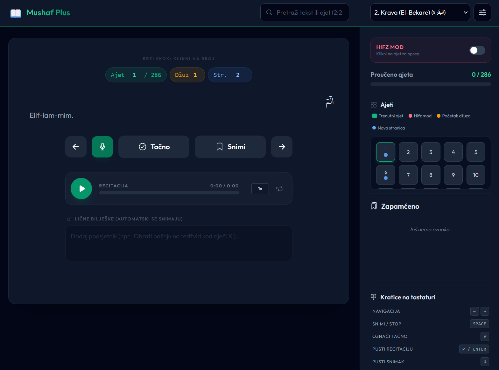

# Mushaf Plus 📖

Vrhunska, potpuno responzivna aplikacija koja se pokreće u web pregledniku, dizajnirana da pomogne korisnicima pri učenju napamet i usavršavanju učenja Kur'ana (tedžvid) s korisničkim interfejsom na bosanskom jeziku.



Izrađena isključivo modernim web tehnologijama, ova aplikacija radi potpuno lokalno u pregledniku, nudeći izuzetno responzivno, privatno okruženje za učenje s podrškom za rad bez interneta (offline).

## ✨ Ključne karakteristike

- **Audio bez kašnjenja**: Uživajte u potpuno neprekidnom slušanju između ajeta zahvaljujući pametnom učitavanju zvuka unaprijed.
- **Munjevito brza pretraga**: Pretraga se sada odvija trenutno u pozadini bez usporavanja aplikacije, čak i na starijim uređajima.
- **Integrisana navigacija ajetima**: Skočite na bilo koji ajet trenutno, jednostavnim upisivanjem broja direktno u brojač ajeta na glavnom prikazu.
- **Minimalistička navigacija po džuzu i stranici**: Skočite direktno na bilo koji džuz (1-30) ili stranicu (1-604) unosom u polja u zaglavlju aplikacije.
- **Hifz mod (učenje napamet)**: Namjenski mod za ponavljanje određenog opsega ajeta. Odaberite početni (S) i krajnji (E) ajet na mreži, omogućite "Automatski sljedeći" i audio će se neprestano ponavljati.
- **Odabir učača (EveryAyah)**: Pristup vrhunskim svjetskim učačima (Mishary Alafasy, Al-Sudais itd.) sa EveryAyah.com direktno unutar izbornika u postavkama.
- **Centralizirani prijevod na bosanski jezik**: Potpuno lokaliziran interfejs koji koristi prilagođeni `i18n.js` mehanizam za prevođenje.
- **Označavanje tedžvida bojama i info oblačići**: Napredni tekstualni engine koji ističe pravila tedžvida (ihfa, izhar, kalkala itd.) s info oblačićima (tooltips) u stvarnom vremenu koji objašnjavaju svako pravilo pri kliku.
- **Globalna pretraga**: Trenutno pretraživanje kroz cijeli Kur'an po tekstualnom sadržaju ili referenci (npr. "2:255"). Radi uz pomoć padajućeg menija s odgođenim (debounced) rezultatima.
- **Sistem za samostalno snimanje**: Koristi mikrofon vašeg uređaja kako bi vam omogućio snimanje vlastitog učenja (recitacije). Odmah preslušajte snimak kako biste usporedili svoj tedžvid s učenjem šejha.
- **Interaktivne postavke tipografije**: Prilagodite svoje iskustvo učenja pomoću klizača (slajdera) koji u realnom vremenu ažuriraju veličinu arapskog fonta, veličinu fonta prijevoda te visinu linije (prored). Uključuje prikaz uživo (preview) sure Ihlas i prijevoda.
- **Dualni interfejs (tamni/svijetli način)**: Besprijekorno prebacivanje između tamnog (Dark Mode) i svijetlog načina (Light Mode), uz višestruke teme naglaska (smaragdna, plava, ćilibar, roza, ljubičasta, tirkizna).
- **Praćenje napretka i mreža ajeta**: Označite ajete kao "Tačno" (naučeno) kako biste vizuelno pratili napredak. Sadrži kompaktnu, responzivnu mrežu ajeta za brzu navigaciju.
- **Oznake (Bookmarks) i bilješke**: Spremite svoja omiljena mjesta i dodajte privatne bilješke na bilo koji ajet. Vaša sesija se automatski obnavlja (posljednja gledana sura) pri ponovnom pokretanju aplikacije.
- **Prečice na tastaturi**: Napredne prečice za učenje bez korištenja miša (`Space` za snimanje, `P` za učenje šejha, `U` za preslušavanje vašeg snimka).
- **Prenosivost podataka**: Izvezite i uvezite (Import/Export) vaš napredak, oznake i bilješke u obliku JSON datoteke.

## 🛠 Korištene tehnologije (Tech Stack)

- **Frontend**: HTML5, Vanilla JavaScript (ES6+)
- **Stiliziranje**: Tailwind CSS + Custom CSS (`css/styles.css`) za precizno podešenu responzivnost i varijable tema.
- **Ikone**: [Ionicons](https://ionic.io/ionicons)
- **Podaci**: Statički JavaScript nizovi koji sadrže kur'anski tekst i reference (`quran_data.js`).
- **Lokalizacija**: Specijalizirani `i18n.js` za dinamičko upravljanje tekstom aplikacije.

## 🚀 Pokretanje aplikacije

Pokretanje aplikacije je jednostavno jer ne zahtijeva backend (server). Da biste je pokrenuli:

1. Klonirajte (Clone) ili preuzmite (Download) ovaj repozitorij.
2. Pobrinite se da imate audio MP3 datoteke u folderu `mp3/` (format: `[BrojSure][BrojAjeta].mp3`).
3. Otvorite datoteku `index.html` u bilo kojem modernom web pregledniku.

### 🎨 Razvoj i stiliziranje

Aplikacija koristi statični produkcijski "build" za **Tailwind CSS**. Ako mijenjate strukturu u `index.html` ili dodajete nove klase, potrebno je ponovno generisati CSS datoteku:

```bash
npx tailwindcss -i ./css/input.css -o ./css/tailwind-output.css --minify
```

### Napomena o dozvolama za mikrofon

Pristup mikrofonu zahtijeva siguran kontekst (HTTPS ili localhost). Ako aplikaciju pokrećete lokalno, molimo vas da koristite server kao što je **VS Code Live Server** ili slično da biste omogućili funkcionalnost snimanja vašeg učenja.

## 🗂 Struktura projekta

```text
├── index.html        # Glavni standardni UI HTML
├── css/
│   ├── styles.css            # Centralizirana prilagođena tipografija i logika za teme
│   ├── input.css             # Tailwind input datoteka
│   └── tailwind-output.css   # Glavna produkcijska kompajlirana CSS datoteka
├── js/
│   ├── app.js        # Inicijalizacija i logika globalne pretrage
│   ├── i18n.js       # Bosanski prevodilački engine i definicije znakova (stringova)
│   ├── actions.js    # Logika za oznake, bilješke i praćenje napretka
│   ├── audio.js      # MediaRecorder i audio engine
│   ├── render.js     # Dinamička manipulacija DOM elementima i logika mreže ajeta
│   ├── config.js     # Upravljanje stanjem (AppState) i reference na DOM elemente
│   └── utils.js      # Formatiranje tedžvida i pomoćni (helper) alati
├── quran_data.js     # Set podataka s tekstom Kur'ana (arapski i prijevod)
└── mp3/              # (Osigurava korisnik) Audio fajlovi s učenjem šejhova
```

## ⌨️ Prečice na tastaturi

| Tipka             | Akcija                               |
| ----------------- | ------------------------------------ |
| `Desna strelica`  | Sljedeći ajet                        |
| `Lijeva strelica` | Prethodni ajet                       |
| `Space`           | Uključi/isključi snimanje mikrofonom |
| `V`               | Označi ajet kao "Tačno"              |
| `P` / `Enter`     | Pusti/pauziraj učenje šejha          |
| `U`               | Pusti/pauziraj svoj snimak           |
