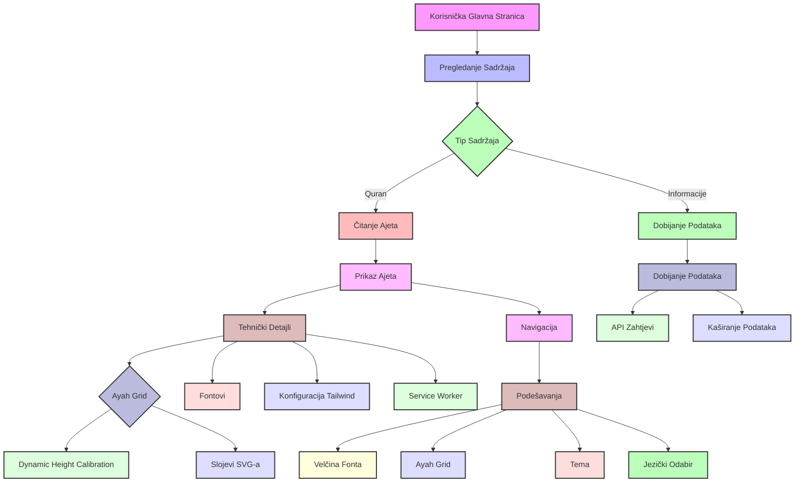

```mermaid
graph TD
    %% Korisnički interfejs
    A[Korisnička Glavna Stranica] --> B[Pregledanje Sadržaja]
    
    %% Tipovi sadržaja
    B --> C{Tip Sadržaja}
    C -->|Quran| D[Čitanje Ajeta]
    C -->|Informacije| E[Dobijanje Podataka]
    
    %% Čitanje ajeta
    D --> F[Prikaz Ajeta]
    F --> G[Tehnički Detajli]
    G --> H{Ayah Grid}
    H --> I[Dynamic Height Calibration]
    H --> J[Slojevi SVG-a]
    
    %% Tehnički detajli
    G --> K[Fontovi]
    G --> L[Konfiguracija Tailwind]
    G --> M[Service Worker]
    
    %% Navigacija
    F --> N[Navigacija]
    N --> O[Podešavanja]
    
    %% Podešavanja
    O --> P[Velčina Fonta]
    O --> Q[Ayah Grid]
    O --> R[Tema]
    O --> S[Jezički Odabir]
    
    %% Podaci
    E --> T[Dobijanje Podataka]
    T --> U[API Zahtjevi]
    T --> V[Kaširanje Podataka]
    
    %% Styling
    style A fill:#f9f,stroke:#333,stroke-width:2px
    style B fill:#bbf,stroke:#333,stroke-width:2px
    style C fill:#bfb,stroke:#333,stroke-width:2px
    style D fill:#fbb,stroke:#333,stroke-width:2px
    style E fill:#bfb,stroke:#333,stroke-width:2px
    style F fill:#fbf,stroke:#333,stroke-width:2px
    style G fill:#dbb,stroke:#333,stroke-width:2px
    style H fill:#bbd,stroke:#333,stroke-width:2px
    style I fill:#dfd,stroke:#333,stroke-width:2px
    style J fill:#ddf,stroke:#333,stroke-width:2px
    style K fill:#fdd,stroke:#333,stroke-width:2px
    style L fill:#ddf,stroke:#333,stroke-width:2px
    style M fill:#dfd,stroke:#333,stroke-width:2px
    style N fill:#fbf,stroke:#333,stroke-width:2px
    style O fill:#dbb,stroke:#333,stroke-width:2px
    style P fill:#ffd,stroke:#333,stroke-width:2px
    style Q fill:#ddf,stroke:#333,stroke-width:2px
    style R fill:#fdd,stroke:#333,stroke-width:2px
    style S fill:#bfb,stroke:#333,stroke-width:2px
    style T fill:#bbd,stroke:#333,stroke-width:2px
    style U fill:#dfd,stroke:#333,stroke-width:2px
    style V fill:#ddf,stroke:#333,stroke-width:2px

```
