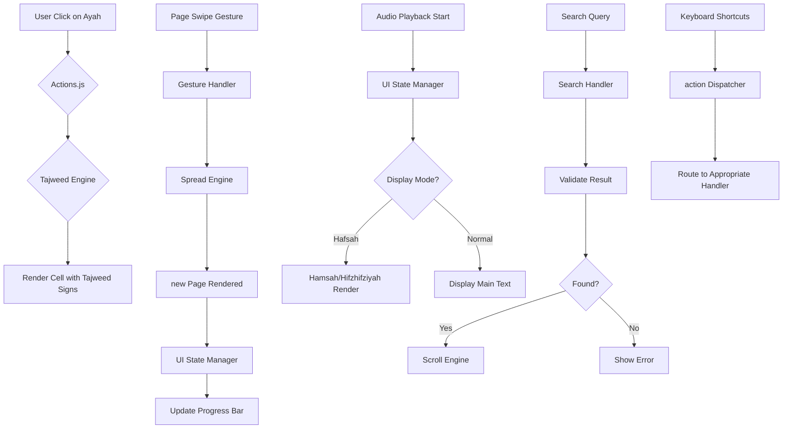

# Component User Flows

## Table of Contents
- [App Initialization](#app-initialization)
- [Render Engine](#render-engine)
- [UI State Manager](#ui-state-manager)
- [Spread Engine](#spread-engine)
- [Audio Controller](#audio-controller)
- [Search Handler](#search-handler)
- [Gesture Handler](#gesture-handler)
- [Keyboard Shortcuts](#keyboard-shortcuts)
- [Validation System](#validation-system)
- [Tajweed Engine](#tajweed-engine)
- [Actions Manager](#actions-manager)

---

## App Initialization

### Component: `app.js` (main entry point)

**Trigger**: Page load / Window focus

**Flow:**
```
1. Initialize global state
   ├─ Load config settings from localStorage
   ├─ Apply theme preferences (dark/light mode)
   └─ Set up event listeners for main containers

2. Check app state
   ├─ If new installation → Show welcome screen
   ├─ If returning user → Load last page/position
   └─ Load book data, recitation style, and settings

3. Render initial page (surat/ayah navigation)
   ├─ Fetch SVG layers from server
   ├─ Call renderEngine.renderPage(page)
   └─ Attach all interactive event listeners

4. Register global events
   ├─ Window resize → trigger height calibration
   ├─ Storage change → sync settings
   └─ Touch/keydown → route to appropriate handler
```

---

## Render Engine

### Component: `render.js`

**Responsibility**: Rendering individual ayahs and cells

**Flow:**
```
1. renderPage(pageNumber, verseCount)
   ├─ Calculate page dimensions
   ├─ Determine spread (right/left/full)
   ├─ Call cellRenderer.render()
   └─ Set background grid color based on theme

2. renderCell(ayah, index)
   ├─ Build SVG path from ayah data
   ├─ Render main text layer (QPC Arabic)
   ├─ Overlay Brevity marks (harakat/ghunna)
   ├─ Apply Tajweed signs if enabled
   ├─ Handle special cases (qalaqalah, idgham, etc.)
   └─ Return cell element with attached event listeners

3. renderAyah(ayahData, index)
   ├─ Create div container
   ├─ Set height to cellHeight()
   ├─ If last ayah → add margin-bottom
   ├─ Call renderCell for main text
   ├─ Append number dot (if enabled)
   ├─ Add Bismillah indicator (if applicable)
   └─ Return ayah element object

4. handleAyahClick(cell, ayahIndex)
   ├─ Highlight active cell
   ├─ Update scroll position to center on cell
   ├─ Fire click event for replay feature
   └─ If hafsah mode → fetch hamzatulwasl/hifzhifziyah variants
```

---

## UI State Manager

### Component: `ui-state.js`

**Responsibility**: Managing UI visibility states (overlays, active elements)

**Flow:**
```
1. toggleOverlay(overlayId, show)
   ├─ Get overlay element by ID
   └─ If show:
      ├─ Remove opacity-0 class
      └─ Add active listeners to close button
   ┐ Else:
      └─ Add opacity-0 class

2. setActiveElement(elementType, index)
   ├─ If Hafsah mode (active ayah):
      ├─ Highlight hamzatulwasl variants
      ├─ Show hifzhifziyah indicators
      └─ Render different text styles for each variant
   └─ If qalaqalah mode:
      └─ Mark letters with diacritics

3. clearActiveElement()
   ├─ Hide Hafsah variants
   ├─ Remove highlighting from hifzhifziyah
   └─ Clear all active classes

4. updateProgressBar()
   ├─ Get current chapter progress
   ├─ Update progress bar width
   └─ Animate with opacity transition
```

---

## Spread Engine

### Component: `spread_engine.js`

**Responsibility**: Page navigation and layout calculations

**Flow:**
```
1. renderSurah(surahIndex)
   ├─ Build page array for spread (2 pages or 1 full)
   ├─ Set activePage to right half of screen
   └─ Call renderPage with calculated pages

2. navigateToPage(pageNumber)
   ├─ Calculate target page index
   ├─ If on same spread → render cell(s) only
   ├─ If different spread → render full page array
   └─ Update activePage state

3. nextPage() / prevPage()
   ├─ Check boundaries (can't go beyond total pages)
   ├─ Calculate target page
   ├─ Call navigateToPage(target)

4. initPageCol(pageIndex, isFirst)
   ├─ Set initial opacity to 0 for animation
   └─ After render:
      ├─ If isFirst (right page):
        ├─ Fade from right → opacity 1
        └─ Show active cell(s) if exist
      ├─ Else (left page):
        ├─ Hide if out of bounds
        │ Set initial left position for fade in
        │ Then show if not first
```

---

## Audio Controller

### Component: `audio.js`

**Responsibility**: Playing audio by various modes/speeds

**Flow:**
```
1. playAudio(target, mode)
   ├─ Get appropriate audio source based on mode:
     ├─ NORMAL → Quran recitation
     ├─ HAFSAH → Multiple variant tracks (hamzatulwasl/hifzhifziyah)
     ├─ IDGHAM/IDGHL/QALQALA/GHUNNA → Qari-specific modes
   └─ Play audio with speed adjustment from settings

2. handleAudioComplete(event)
   ├─ Clear active element states
   ├─ Hide all variants/harakat
   └─ Reset tooltip visibility

3. updateCurrentText()
   ├─ Get current playing ayah/index
   ├─ If Hafsah mode:
     ├─ Fetch and render hamzatulwasl variant
     ├─ Fetch and render hifzhifziyah indicator
     └─ Render corresponding text for current audio file
   └─ Else → Show main text as default

4. pauseAudio() / resumeAudio()
   ├─ If paused → play from current position
   └─ Else → pause and stop current track
```

---

## Search Handler

### Component: `search-handler.js`

**Responsibility**: Searching ayahs/chapters by number/name

**Flow:**
```
1. search(query, type = "ayah")
   ├─ Parse query (number or name)
   ├─ If Ayah search:
     ├─ Validate format (digit + optional letter)
     ├─ Find chapter and ayah in data
     └─ Scroll to target cell
   ┐ If Chapter search:
     ├─ Search by Arabic name/English translation
     └─ Navigate to first ayah of chapter
   └─ Show results count if found

2. handleSearchResult(result)
   ├─ If result exists:
     ├─ Scroll visible within 1 second (if not auto-centered)
     │ Wait for scroll event → trigger center
     ├─ Play audio at target position
     └─ Show result indicator in UI
   ├── Show error message if not found

3. resetSearchState()
   └─ Clear search UI elements and reset scroll position
```

---

## Gesture Handler

### Component: `gesture-handler.js`

**Responsibility**: Handling horizontal swipe gestures

**Flow:**
```
1. handleTouchStart(e)
   ├─ Record startX position
   ├─ Set initial velocity to 0

2. handleTouchMove(e)
   └─ Calculate pullDistance from startX

3. handleGestureEnd(pullDistance, direction)
   ├── If swipe threshold met:
   │ ├─ Play page change sound effect
   │ ├─ Determine next page based on direction:
   │ │ ├─ Left swipe → move right
   │ │ └─ Right swipe → move left
   │ └─ Call spreadEngine.navigateToPage(targetPage)
   └── If threshold not met:
      └─ Reset indicator opacity

4. handleSwipe(pageChange)
   ├─ Animate next page (via UI state animations)
   ├─ Update progress bar accordingly
```

---

## Keyboard Shortcuts

### Component: `keyboard-shortcuts.js`

**Responsibility**: Handling keyboard interactions

**Flow:**
```
1. init()
   └─ Bind global keydown events to window/frames

2. handleKeydown(event)
   ├─ Detect modifier keys first:
     ├─ Ctrl/Cmd + K → focus search input
     ├─ Esc → close active overlays/tooltips
     └─ F (with modifiers) → toggle fullscreen
   ┐ Handle single keys:
     ├─ Arrow keys → navigate ayahs within current view
     └─ Number keys → jump to chapter if valid

3. handleScrollToTarget(cell, delay = 1000ms)
   ├─ Set scrollTop based on cell position
   ├─ Trigger scroll event listener
   │ After timeout (if delay specified):
   │ ├─ Calculate center point
   │ └─ Scroll to center if not already visible
```

---

## Validation System

### Component: `validation.js`

**Responsibility**: Server requests and data validation

**Flow:**
```
1. checkQuranMeta()
   ├─ Fetch latest metadata from Quran Meta API
   ├─ Validate response (checkStatus, validateData)
   └─ If valid → Update app state with new metadata

2. requestServerAction(actionType, params)
   ├─ Validate action type is allowed
   ├─ Sanitize parameters (prevent XSS injection)
   ├─ Make POST/GET request to API endpoint
   ├─ Handle response:
     ├─ On success → Trigger appropriate event handler
     │ ├─ Play sound effect
     │ └─ Update UI state
     ├─ On error (network/timeout):
       ├─ Show error notification
       └─ Disable retry button if needed

3. validateAyah/ayahExists()
   ├─ Call server to verify ayah exists
   ├─ If not found → Return error response
   └─ Client can then decide how to handle missing data
```

---

## Tajweed Engine

### Component: `tajweed_engine.js` + `tajweed.js`

**Responsibility**: Rendering Tajweed signs and tooltips

**Flow:**
```
1. init() (in app.js)
   ├─ Call tajweed.init()
   └─ Register Tajweed event listener for UI updates

2. setTajweedMode(mode)
   ├─ mode can be: 'qalaqalah', 'idgham', 'idghl', 'ghunna'
   └─ Trigger renderEngine.renderCell() to re-render cells with sign overlays

3. handleAyahClick(event)
   ├─ Call tajweed.handleAyahClick(cell, ayahIndex)
   └─ Render sign overlay (harakat/gnunna) as div positioned at text character location

4. showTajweedTooltip(targetElement, tipData)
   ├─ Create tooltip element with unique ID
   ├─ Set content from TAJWEED_TOOLTIPS object
   ├─ Position below target element with collision detection
   └─ Apply CSS animations (fadeIn)
```

---

## Actions Manager

### Component: `actions.js`

**Responsibility**: Managing book navigation and actions

**Flow:**
```
1. navigateBook(bookIndex)
   ├─ Set active page index based on book data
   ├─ Call spreadEngine.renderSurah(surahIndex)
   ├─ Hide previous bookmarks (if any exist)

2. handleBookmarkCreation(pageNumber, ayahIndex)
   └─ Save bookmark with metadata to localStorage

3. restoreBookmarks()
   ├─ Fetch bookmarks from localStorage
   ├─ If none: Create initial bookmark at current position
   └─ Render bookmarks in sidebar component

4. handleHifzCompletion()
   ├─ Clear hifz state (no more active ayahs)
   ├─ Hide Hafsah-specific overlays
   └─ Reset all Hafsah variants to default display

5. handleSearchResult(result)
   ├─ Validate search result exists
   ├─ Scroll to target ayah/cell
   │ Wait for scroll event → trigger auto-center
   └─ If hifazah mode: Show multiple variant options
```

---

## Integration Points

### Event Flow Between Components



---

## State Management Summary

### Global State (maintained across all components)

| State Variable | Owner Component | Mutated By |
|----------------|-----------------|------------|
| `activePageIndex` | Render Engine | Spread/Actions/Navigation |
| `currentAyahData` | Render Engine | Search/Hijz/Replay |
| `bookmarks` | Actions.js | Bookmark Creation |
| `scrollPosition` | UI State Manager | Scroll events/Keyboard |
| `activeElement` | UI State Manager | Hafsah/Qalaqalah modes |
| `theme` | App Initialization | Theme toggle switch |
| `mode` | Render Engine | User settings change |
| `surahIndex` | Spread Engine | Navigation actions |

---

## Error Handling Flow

```
Any Component Error → try/catch in component handler
    ↓
  Show error notification (UI layer)
    ↓
  Disable error-triggered feature
    ↓
  Log to console + localStorage for debugging
    ↓
  If retryable: Show retry option
```

---

*Last updated: March 20, 2026*
